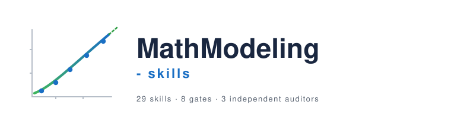

<p align="center">
  
</p>

<p align="center">
  <a href="./README.md"><b>English</b></a> ·
  <a href="./README-zh.md">简体中文</a> ·
  <a href="./CLAUDE.md">Project Rules</a> ·
  <a href="./Initial%20Prompt.md">Initial Prompt</a> ·
  <a href="mailto:zjzhang0424@gmail.com">📧 Contact</a>
</p>

<p align="center">
  
  
  
  
</p>

---

> A set of skills I built for math-modeling contests after losing too many hours to the same kinds of mistakes. They sit behind a set of hard gates — two of which are yours to decide, not the AI's — and a 3-auditor layer that has the last word on whether the paper is ready to hand in. The point isn't to automate more — it's that no step gets to quietly skip a check. Numbers in the paper trace back to a frozen snapshot. Reviewers leave a file on disk. No skill gets to say "done" on its own.
>
> The split it's built on: **the AI owns the mechanical correctness; you own the modeling judgment.** It runs the PoCs, freezes the numbers, render-checks the figures, audits consistency. It does *not* choose your method, decide what a number means, or write the reason you chose what you chose — those are yours, and the gates fail on an empty or copy-pasted answer. It's an assistant, not a ghost-writer. (More on that in [What this isn't](#what-this-isnt).)
>
> If you find a bug or want to tell me how it went in a real contest, drop me a line at **[zjzhang0424@gmail.com](mailto:zjzhang0424@gmail.com)** — or open an issue.

## Why this exists

When a team loses a modeling contest, it's almost never because they didn't know enough models. It's usually one of these:

- They misread what the problem was actually asking.
- They skipped the baseline and went straight to a complicated model nobody could explain later.
- The paper says some number that no script in the repo actually outputs.
- Somebody fixed a bug at 3am, and the paper still has the old numbers from before the fix.

These are workflow problems, not modeling problems. The skills here are arranged so those specific failures get hard to hide.

## What's different

| | A typical pipeline | This one |
|---|---|---|
| How you move on | "this stage is done, next" | Each gate has an explicit pass condition. Fail it and everything downstream gets marked stale. |
| Which method, and why | The AI picks and writes the justification | The AI lays out candidates and runs the feasibility checks; **you** commit the choice and write the reason, in your own words. The gate fails on an empty or copy-pasted rationale (Gate G2.5). |
| From idea to code | A method is accepted if the math looks right | Each candidate ships with a ≤30-line PoC and a real number from running it on the actual data (Gate G2) |
| Code review | Someone says "looks fine" | A review file on disk with ≥ 5 specific things that were checked, file:line cited (Gate G3) |
| Numbers in the paper | Re-read from the latest results each time | Frozen into `frozen_numbers.json`. Changing one means logging the change and re-freezing (Gate G4) |
| "Done" | One QA pass | Three separate auditors. Any one fails, the paper doesn't ship (Gate G6) |
| Methods you dropped | Hang around the main folder | Get moved to `workspace/archived/` so they don't accidentally end up in the paper |

## The pipeline

```text
workflow-orchestrator (env ping at session start)
 ▼  problem-parser → problem-classifier → related-paper-analyzer       [ G1: PROBLEM_PARSED ]
 ▼  symbol-table-builder + model-assumptions-builder + data-auditor-cleaner
 ▼  method-selector   ── each candidate ships ≤30-line PoC + number    [ G2: METHOD_VALIDATED  ★ ]
 ▼  model-code-analyzer → {python,matlab}-model-code-generator
 ▼  code-reviewer (router) → {python,matlab}-code-reviewer             [ G3: CODE_REVIEWED ]
 ▼  result-report-generator ([REJECTED] archived)
 ▼  robustness-checker → final-method-explainer
 ▼  figure-table-planner → math-figure-generator (render_check)
 ▼  solution-package-builder ── emits frozen_numbers.json              [ G4: RESULTS_FROZEN   ★ ]
 ▼  paper-section-writer (word floor + ≥3 discussion dims per number)  [ G5: PAPER_SECTION_READY ]
 ▼  paper-polisher → reference-manager
 ▼  Independent audit layer (all three must PASS):
       consistency-auditor · completeness-auditor · quality-assurance-auditor
                                                                       [ G6: AUDIT_LAYER_PASSED ]
 ▼  final assembly
```

The two starred gates are where most contest pipelines actually fall apart. G2 catches the case where a method looked elegant in a discussion but doesn't work on the real data. G4 catches the case where someone fixed a bug late at night and forgot the paper still quotes the old number.

## The skills, by where they sit in the pipeline

### Stage 1 — getting the basics straight

Before any modeling happens, get the foundation right: what the problem is actually asking, what kind of problem each subquestion is, what data you've got, and a single symbol table everyone agrees on.

- **`workflow-orchestrator`** — Keeps track of where each subquestion is, runs the gate checks, pings your environment at session start.
- **`problem-parser`** — Reads the problem into goals / objects / constraints / data / outputs / subquestions. Writes to `planning/parse/`.
- **`problem-classifier`** — Tags each subquestion with a task type. `planning/classification/`.
- **`related-paper-analyzer`** — Collects relevant papers. Won't make up citations.
- **`symbol-table-builder`** — One shared symbol table for everyone. `planning/symbol_table.md`.
- **`model-assumptions-builder`** — Separates the assumptions you actually need from the ones you're making to simplify. `planning/model_assumptions.md`.
- **`data-auditor-cleaner`** — Audits raw data, produces a cleaned copy and a report. Treats `data_raw/` as read-only. **Also has a step 0 that confirms which attachment belongs to which subquestion before anything else** — turns out this matters more than you'd think.

### Stage 2 — method validation (Gate G2 ★)

This is the boundary where most teams lose three days near the deadline. A method that looked great in a meeting turns out to be infeasible on the actual data, and now it's too late to switch.

- **`method-selector`** — Proposes 2–4 candidates per subquestion. **Each one ships with a runnable ≤30-line PoC and a real number from running it on the cleaned data.** If the PoC fails, the candidate is marked `[REJECTED]` and its script moved to `workspace/archived/`. It does **not** pick for you — it lays out the candidates and stops; you commit the choice and write why (Gate G2.5). Outputs: `methods/Qx/qx_method_candidates.md` + `methods/Qx/poc/*`.
- **`decision-prompt-builder`** — At each judgment gate, asks you the 2–3 questions only you can answer (framed as trade-offs), before the AI shows its suggestion — so you decide, not rubber-stamp. Used here and at every later human gate.
- **`modeler-decision-logger`** — The decision-side `frozen_numbers.json`: collects your committed decisions into one append-only log. Every "why we chose X" sentence in the paper traces back to it, so the AI can't quietly re-author your reasoning.

### Stage 3 — code, then review (Gate G3)

Write the code, then actually review it. The review is a file on disk, not a sentence in chat.

- **`model-code-analyzer`** — Plans the `experiments/roundN/` folder layout and the `run_summary.json` schema before any code is written.
- **`python-model-code-generator`** — Generates `.py` when the target is `python`. Fixed `SEED = 2026`.
- **`matlab-model-code-generator`** — Generates `.m` for MATLAB / 北太天元. No Live Scripts, no App Designer, no anything that won't run on the contest machine.
- **`code-reviewer`** — Looks at the script type, hands off to the right language-specific reviewer.
- **`python-code-reviewer`** — Writes `code/Qx/reviews/qx_python_review.md` with ≥ 5 specific things that were checked, each citing file:line. Also lists every inequality constraint in a small table so a human can scan whether the direction is right.
- **`matlab-code-reviewer`** — Same idea for `code/matlab/Qx/reviews/qx_matlab_review.md`.

### Stage 4 — results, robustness, figures, freeze (Gate G4 ★)

Take the raw experiment outputs and turn them into two things: a package the writer can read, and a frozen JSON of every number that will appear in the paper. After the freeze, if you fix a bug and a number changes, you have to log the change and re-freeze. Nobody silently updates the snapshot.

- **`result-report-generator`** — Compares methods per round, then a final analysis. Methods get tagged `[CHOSEN] / [BACKUP] / [REJECTED]`. Rejected ones move to `workspace/archived/`.
- **`robustness-checker`** — Sensitivity / error / baseline comparison. Writes `robustness/Qx/qx_robustness_report.md` with ≥ 5 things checked.
- **`final-method-explainer`** — A full writeup of the method you actually committed to. `methods/Qx/qx_final_method_explanation.md`.
- **`figure-table-planner`** — Sorts figures into four types: 1 diagnostic, 2 comparison, 3 paper, 4 appendix. Type 1 never reaches the paper.
- **`math-figure-generator`** — Publication-quality matplotlib. Every figure has to pass `render_check_and_log()` (no text overlap, no text out of canvas, no font under 6.5pt) before it's allowed to become a Type 3 figure.
- **`solution-package-builder`** — Builds the package the writer reads, and emits `results/Qx/reports/frozen_numbers.json`. Don't edit that file by hand.

### Stage 5 — writing the paper, then the auditors (Gates G5 + G6)

The writer drafts the paper, sourcing every number from the frozen JSON. Then three separate auditors check it: one for cross-file consistency, one for whether every reviewer actually left a file, one for end-to-end QA. If any of the three fails, the paper doesn't ship.

- **`paper-section-writer`** — Drafts sections from the package. Each section has a word-count floor. Every number you cite needs to be discussed from at least 3 of: sensitivity, physical meaning, baseline comparison, cross-subquestion consistency, uncertainty.
- **`paper-polisher`** — Tense, hedging, overclaiming, formula consistency within the document.
- **`reference-manager`** — BibTeX, plus a check that the citations actually exist. Fabricated citations are blocking.
- **`consistency-auditor`** — Goes through the paper and checks every number, file name, and symbol matches what's in `frozen_numbers.json`, the actual files on disk, and the symbol table.
- **`completeness-auditor`** — Checks that every `*_review.md` / `*_audit.md` that should exist actually exists, with at least 5 pass items, not stale.
- **`quality-assurance-auditor`** — Workflow completeness, the three critical rules, anti-fabrication. The final gate — only signs off when the other two auditors have also signed off.

## Installing

Most people clone this into the folder where they'll do the actual contest work, so `CLAUDE.md` / `AGENTS.md` / `.claude/settings.json` apply automatically. You can also install the skills globally if you'd rather.

### Option A — clone into your contest project (recommended)

```bash
# inside the folder that will hold methods/ code/ results/ paper/ ...
git clone https://github.com/KyrieZhang329/MathModeling-skills.git .skills-tmp
mv .skills-tmp/.claude .claude
mv .skills-tmp/.codex .codex
mv .skills-tmp/CLAUDE.md .
mv .skills-tmp/AGENTS.md .
mv .skills-tmp/docs ./skills-docs
rm -rf .skills-tmp
```

Open the folder in **Claude Code** or **Codex** — the 28 skills get picked up automatically. First message:

```text
Read CLAUDE.md, then run workflow-orchestrator. Our contest problem is in workspace/problem/. Follow the gates in order and do not skip.
```

### Option B — install globally for Claude Code

```bash
git clone https://github.com/KyrieZhang329/MathModeling-skills.git
cd MathModeling-skills

mkdir -p ~/.claude/skills
for d in .claude/skills/*/; do
  cp -R "$d" ~/.claude/skills/
done
```

Restart Claude Code. The skills are available in any project now. You still want `CLAUDE.md` and `.claude/settings.json` in each contest project — that's where the gate rules and guardrails live.

### Option C — install globally for Codex

```bash
git clone https://github.com/KyrieZhang329/MathModeling-skills.git
cd MathModeling-skills

mkdir -p ~/.codex/skills
for d in .codex/skills/*/; do
  cp -R "$d" ~/.codex/skills/
done
```

Restart Codex. Drop `AGENTS.md` into each contest project for the gate rules.

### Updating later

```bash
cd MathModeling-skills && git pull
# then re-run the cp loop from B or C if you went global
```

### What to say first

Use the initial prompt for a fresh conversation:

- English: [Initial Prompt.md](Initial%20Prompt.md)
- 中文: [Initial Prompt-zh.md](Initial%20Prompt-zh.md)

### A few follow-up prompts that come up a lot

- Coming back to it: `Q2 has experiment report round1 done. Let workflow-orchestrator decide whether to iterate or lock the method.`
- Just robustness: `Use robustness-checker for Q1. Inputs in results/Q1/reports/, baseline in results/Q1/experiments/round2/. Do not rerun the main model.`
- Triggering the audit layer: `All Qx sections drafted. Run consistency-auditor, then completeness-auditor, then quality-assurance-auditor.`

## Workspace layout

<details>
<summary>Click to expand</summary>

```text
project/
├── planning/                   # parse / classification / symbol table / assumptions / dashboard
├── methods/Qx/                 # candidates + iteration log + final method explanation + figure plan
│   └── poc/                    # ≤30-line PoC per candidate (Gate G2)
├── code/
│   ├── Qx/                     # Python; reviews/qx_python_review.md (Gate G3)
│   └── matlab/Qx/              # MATLAB (parallel structure)
├── results/Qx/
│   ├── experiments/roundN/     # figures / tables / metrics / logs / run_summary.json
│   └── reports/                # experiment + final analysis + solution package + frozen_numbers.json (Gate G4)
├── robustness/Qx/
├── paper/
│   ├── sections/               # word floor + ≥3 discussion dims (Gate G5)
│   ├── figures/                # Type 3 + Type 4 (render_check passed)
│   ├── audits/                 # cross_media / completeness / reference / polish (Gate G6)
│   ├── refs.bib  main.tex  qa_report.md
├── workspace/
│   ├── data_raw/               # read-only (settings.json deny)
│   ├── data_clean/
│   └── archived/<Qx>/<method>_REJECTED_roundN/
└── scratch/                    # temporary; nothing here has to be reproducible
```

A few hard rules: `data_raw/` is read-only. Every paper number lives in `frozen_numbers.json`. `[REJECTED]` methods get archived automatically. `frozen_numbers.json` is never edited by hand.

</details>

## What this isn't

- It's not a one-button paper generator.
- It won't invent missing data, results, or references.
- It won't write a number into the paper before some script has produced it.
- It won't claim a model is better than a baseline without a baseline and a robustness check actually existing.
- It doesn't touch your raw data.
- **It's not a ghost-writer.** The things a judge actually grades and a student actually needs to learn — which method and why, what the numbers mean, how you framed the assumptions, what your contribution is — come from you. The AI drafts the scaffolding around them and marks every judgment span as needing your input; the gates won't pass on an empty box or text copy-pasted from the AI's own suggestion. If you try to let it do all of it, the pipeline blocks before submission.
- It doesn't replace your judgment. You still make the modeling calls.

> **⚠️ Your contest's rules are yours to check.** AI-use policies differ sharply between contests and change every year — COMAP (MCM/ICM) currently allows disclosed AI assistance; CUMCM and several Chinese contests are originality-first and may not permit it at all. This repo encodes no contest's authoritative policy; its defaults aim at the strictest plausible reading. Every run can emit an `ai_use_disclosure.md` recording what was AI-drafted vs human-authored, so you can disclose honestly where required. Read your contest's current official rules before you rely on this — the final compliance call is yours.

## Docs you might actually need

- [CLAUDE.md](CLAUDE.md) — the project rules (gates, audit layer, the frozen-numbers convention).
- [AGENTS.md](AGENTS.md) — same thing, Codex side.
- [docs/implementation-targets.md](docs/implementation-targets.md) — choosing `python` vs `matlab`.
- [docs/matlab-beita-tianyuan-guidelines.md](docs/matlab-beita-tianyuan-guidelines.md) — keeping MATLAB code contest-machine-friendly.
- Per-skill: [.claude/skills/](.claude/skills/) · [.codex/skills/](.codex/skills/).

## Getting in touch

If you found a bug, have an idea, or just want to tell me how it went in a real contest, my email is **[zjzhang0424@gmail.com](mailto:zjzhang0424@gmail.com)**. Issues and PRs welcome too.

## Thanks to

- **[nature-skills](https://github.com/Yuan1z0825/nature-skills)** — `math-figure-generator` borrows the figure-contract idea, the semantic palette, the multi-panel layout thinking, and the SVG-first export from `nature-figure`. By [Yuan1z0825](https://github.com/Yuan1z0825), MIT.
- **[figures4papers](https://github.com/ChenLiu-1996/figures4papers)** — the production scripts that `nature-figure` is built on.

## License

MIT.
